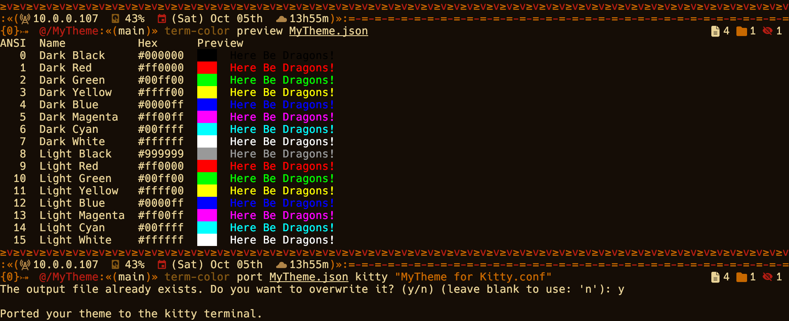

<p align="center">
  
</p>
<h1 align="center">≥v≥v&ensp;TermColor&ensp;≥v≥v</h1>
<p align="center">
  
  &nbsp;
  
  &nbsp;
  
  &nbsp;
  
</p>

## ❡ About
A terminal software to port terminal themes from a single theme file written in JSON format.

<p align="center">
  
</p>
<p align="center"><strong>Caption:</strong> TermColor running on MacOS previewing and porting an example theme. Terminal theme is <a href="https://github.com/skippyr/flamerial">Flamerial</a>. Shell theme is <a href="https://github.com/skippyr/river-dreams">River Dreams</a>. Font is Hack (patched by the <a href="https://www.nerdfonts.com/font-downloads">Nerd Fonts project</a>).</p>

Supported terminal emulators are:

- Alacritty
- Kitty
- Konsole
- LXTerminal
- St
- WezTerm
- Windows Terminal
- XFCE4 Terminal
- XTerm

## ❡ Installation

- Download its latest release from its [releases page](https://github.com/skippyr/TermColor/releases). There, you will have to choose the right version for your operating system: Windows, Linux or Mac; and CPU architecture: x64 or ARM64. 
- After downloaded, extract its zip file.
- Add the software executable extracted, `term-color` or `term-color.exe`, inside a directory and add that directory to your system `PATH` environment variable.
- Open a new terminal and the software should now be installed and ready for you to use.

## ❡ Documentation

After installed, you can read its help page for usage instructions:

```zsh
term-color --help
```

## ❡ Help
If you need help related to this project, open a new issue in its [issues pages](https://github.com/skippyr/TermColor/issues) or send me an [e-mail](mailto:skippyr.developer@icloud.com) describing what is going on.

## ❡ Contributing
This project is open to review and possibly accept contributions, specially fixes and suggestions. If you are interested, send your contribution to its [pull requests page](https://github.com/skippyr/TermColor/pulls) or to my [e-mail](mailto:skippyr.developer@icloud.com).

In order to keep it open-source, by contributing to this project, you must agree to license your work under the same license that the project uses. For other intentions, prefer to create a fork.

## ❡ Copyright
This is free software licensed under the BSD-3-Clause License that comes WITH NO WARRANTY. Refer to the LICENSE file that comes in its source code for license and copyright details.

&ensp;
<p align="center"><sup><strong>≥v≥v&ensp;Here Be Dragons!&ensp;≥v≥</strong><br />Made with love by skippyr <3</sup></p>
